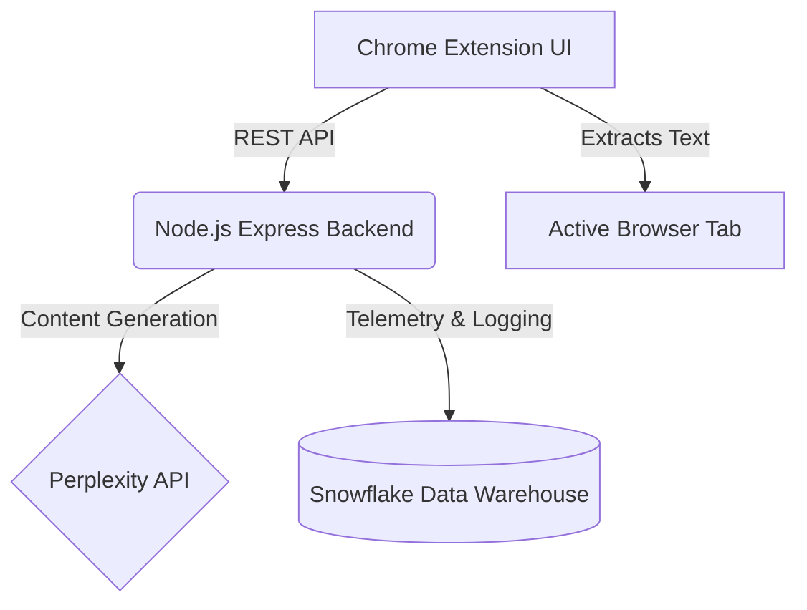

# 🧠 AI Learning Assistant

[](https://opensource.org/licenses/MIT)
[](https://nodejs.org/)
[](https://expressjs.com/)
[](https://www.snowflake.com/)
[](https://developer.chrome.com/docs/extensions/mv3/)

An enterprise-grade, AI-powered study assistant built as a **Chrome Extension** backed by a modular **Node.js/Express** microservice. Designed to accelerate student learning by leveraging the **Perplexity AI API** to dynamically generate summaries, flashcards, and interactive quizzes from any highlighted webpage content. All user interactions and learning sessions are securely logged into a **Snowflake Data Warehouse** for long-term analytics and spaced repetition tracking.

---

## ✨ Features

- **📝 Instant Content Summarization:** Highlight complex text on any webpage and generate a concise, bulleted summary instantly.
- **🗂️ Automated Flashcard Generation:** Automatically extract key concepts into a Q&A style flashcard format to aid in active recall.
- **❓ Interactive Quizzes:** Test comprehension in real-time with dynamically generated 5-question multiple-choice quizzes complete with graded answers.
- **📊 Telemetry & Learning History:** All study sessions (generated materials, quiz scores, topics) are securely logged to Snowflake for scalable querying and user analytics.
- **🔒 Secure Architecture:** Adheres strictly to Chrome Extension **Manifest V3** security standards, ensuring least-privilege access and optimized performance.

---

## 🏛️ Architecture Overview

The project follows a decoupled, service-oriented architecture:



### 🛠️ Tech Stack

- **Frontend:** HTML5, Vanilla CSS (CSS Variables), Vanilla JS (ES6+), Chrome Extension API (MV3)
- **Backend:** Node.js, Express.js
- **AI Integration:** Perplexity AI (`sonar` model)
- **Database:** Snowflake-SDK

---

## 📂 Project Structure

The codebase is organized into a modular architecture to enforce Separation of Concerns (SoC) and maintainability:

```text
AI-Learning-Assistant/
├── backend/                  # Node.js Backend Service
│   ├── middleware/           # Express middlewares
│   │   └── errorHandler.js   # Centralized global error handling
│   ├── routes/               # API route definitions
│   │   └── api.js            # RESTful endpoints (/summary, /flashcards, etc.)
│   ├── services/             # Core business logic & integrations
│   │   ├── perplexity.js     # Perplexity AI service wrapper
│   │   └── snowflake.js      # Snowflake connection & query layer
│   ├── server.js             # Application entry point
│   └── package.json          # Node dependencies
├── extension/                # Chrome Extension Frontend
│   ├── manifest.json         # MV3 Configuration & Permissions
│   ├── popup.html            # Accessible UI Layout
│   ├── style.css             # UI Styling (CSS Variables)
│   └── popup.js              # DOM management & Backend communication
└── README.md                 # Project Documentation
```

---

## 🚀 Getting Started

### Prerequisites

- **Node.js** (v18 or higher recommended)
- A **Perplexity API Key** ([Get one here](https://docs.perplexity.ai/))
- A **Snowflake Account** with warehouse and database configured

### 1. Backend Setup

1. **Clone the repository:**
   ```bash
   git clone https://github.com/yourusername/AI-Learning-Assistant.git
   cd AI-Learning-Assistant/backend
   ```

2. **Install dependencies:**
   ```bash
   npm install
   ```

3. **Configure Environment Variables:**
   Create a `.env` file in the `backend/` directory:
   ```env
   PORT=3000
   PPLX_API_KEY=your_perplexity_api_key

   # Snowflake Configuration
   SF_ACCOUNT=your_snowflake_account_identifier
   SF_USER=your_snowflake_user
   SF_PASSWORD=your_snowflake_password
   SF_WAREHOUSE=your_warehouse_name
   SF_DATABASE=your_database_name
   SF_SCHEMA=your_schema_name
   ```

4. **Start the backend server:**
   ```bash
   node server.js
   ```
   *You should see output indicating the server is running and successfully connected to the Snowflake context.*

### 2. Extension Setup

1. Open your Chromium-based browser (Chrome, Edge, Brave).
2. Navigate to `chrome://extensions/`.
3. Enable **Developer mode** (toggle in the top right corner).
4. Click **Load unpacked** and select the `extension/` directory from this project.
5. Pin the AI Learning Assistant icon to your browser toolbar for quick access.

---

## 💡 Usage Guide

1. **Select Content:** Highlight a block of text, an article, or a documentation page in your browser.
2. **Open Assistant:** Click the AI Learning Assistant extension icon. The text is automatically injected into the extension securely.
3. **Generate:** Click **Summary**, **Flashcards**, or **Quiz**. The backend will process the context via Perplexity AI and return formatted results.
4. **Track Progress:** Click **View History** to see a log of your learning sessions, retrieved dynamically from the Snowflake database.

---

## 🤝 Contributing

We welcome contributions from the open-source community! If you are participating in programs like **GSoC**, **MLH Fellowship**, or looking to contribute:

1. Fork the Project
2. Create your Feature Branch (`git checkout -b feature/AmazingFeature`)
3. Commit your Changes (`git commit -m 'feat: Add some AmazingFeature'`)
4. Push to the Branch (`git push origin feature/AmazingFeature`)
5. Open a Pull Request with a detailed description of your changes.

Please ensure your code adheres to standard JavaScript linting rules and the existing modular architecture.

---

## 📝 License

Distributed under the MIT License. See `LICENSE` for more information.
